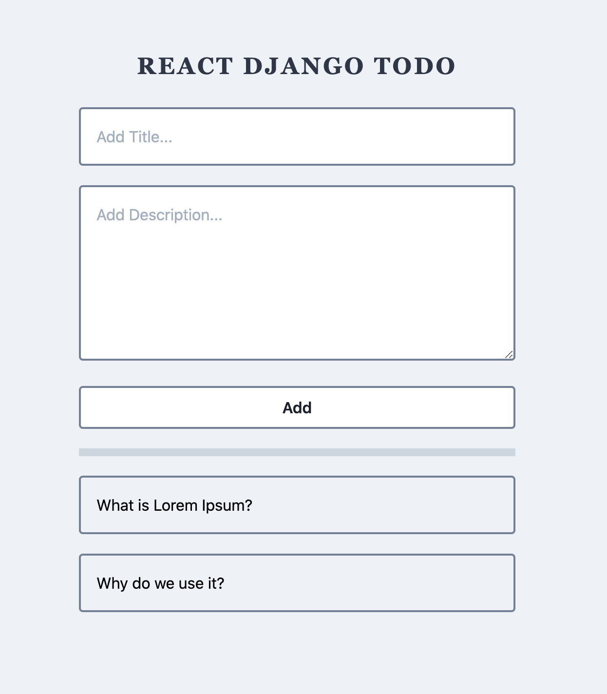
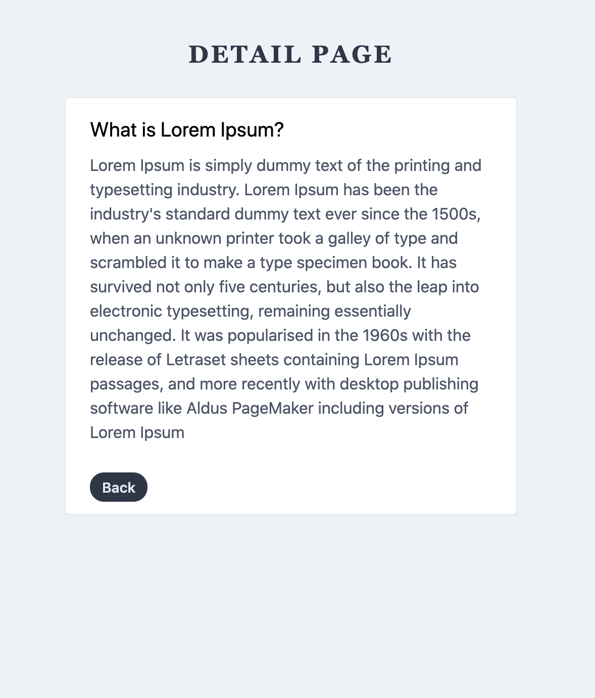

# Todo FullStack App `REACT` and `DJANGO` with Rich Text editor

#### Packages used

## Frontend - React Project created with parcel

1. Language - `Javascript`
2. Framework - `React`
3. Routing - `react-router-dom`
4. CSS - `Tailwind`
5. Style guide - `airbnb`
6. Formatting - `Prettier`
7. Linting - `Eslint`
8. Bundler - `Parcel`
9. JSX and other polyfill - `Babel-7`

## Backend

1. Language - `Python`
2. Framework - `django`
3. CORS - `django-cors-headers`
4. REST - `djangorestframework`
5. Style guide - `autopep8`
6. Formatting - `black`
7. Linting - `pylint`

## Project Start Details

### For Frontend `npm start`

Runs the app in the development mode. 
Open [http://localhost:1234](http://localhost:1234) to view it in the browser.

### For Backend `python manage.py runserver`

start the project and go to [http://localhost:8000/api](http://localhost:8000/api) in browser to view api.
for json format use
[http://localhost:8000/api?format=json](http://localhost:8000/api?format=json)

 

# App UI

### List Page

 

### Detail Page

